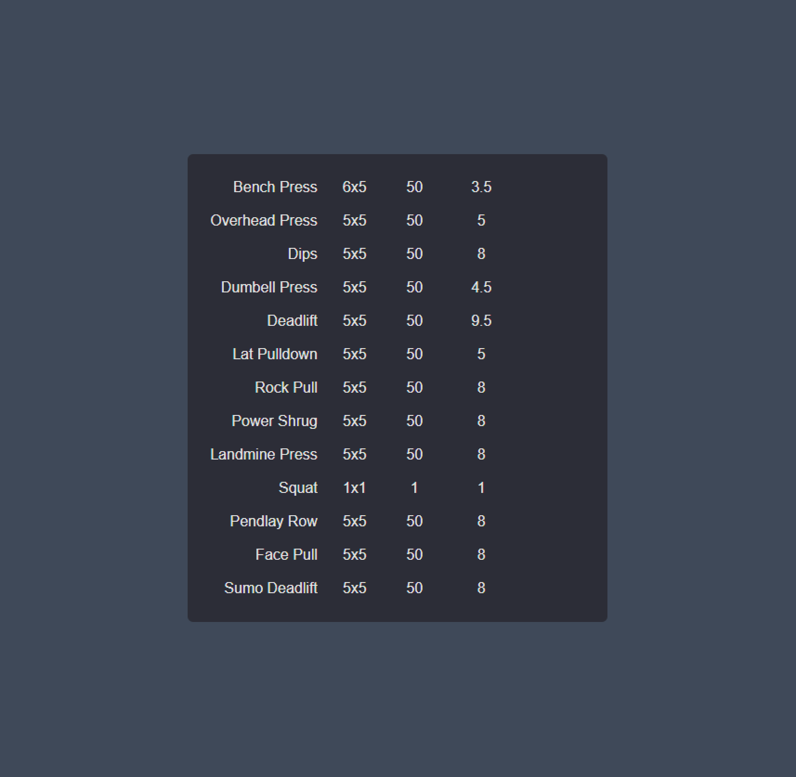

This is a Next.js and Graphql tutorial app that lets you save your latest liftings.



## Getting Started

First, run the development server:

```bash
yarn dev
```

Open [http://localhost:3000](http://localhost:3000) with your browser to see the result.
